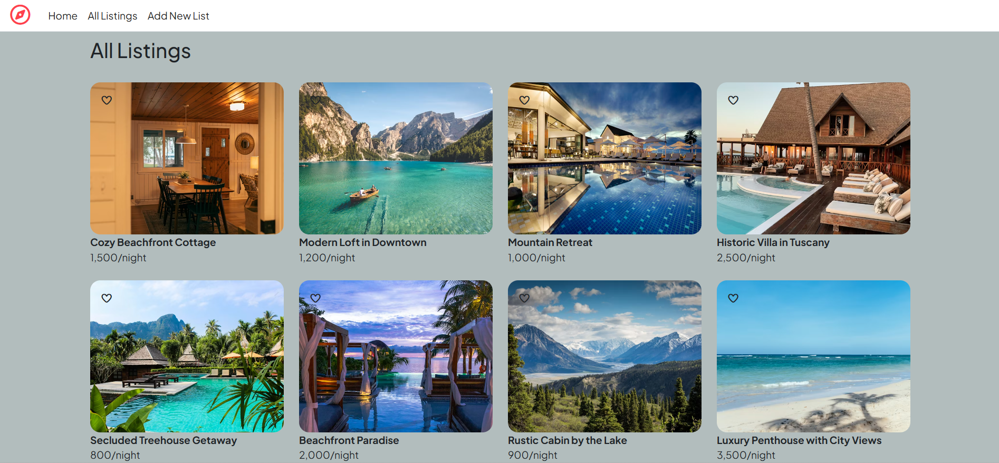
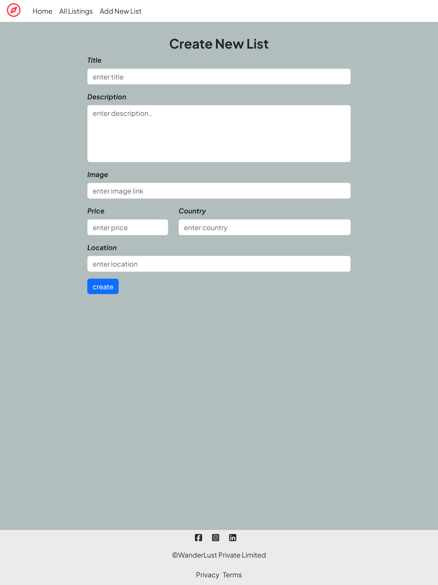
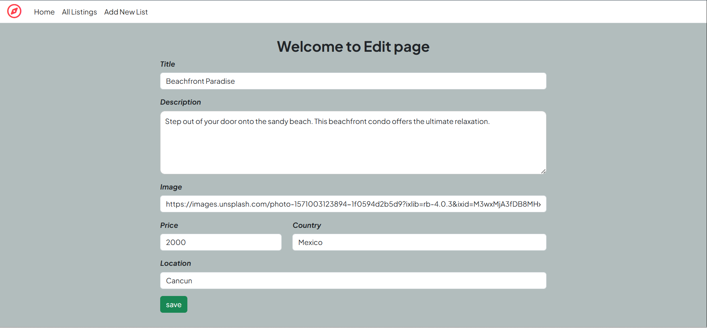
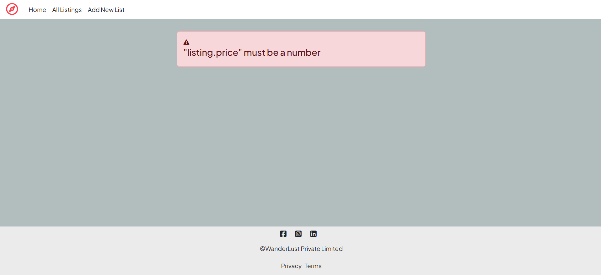

# 🏡 Roomly - A Component-Driven Rental Marketplace

A modular, full-stack rental marketplace built using Node.js, Express, MongoDB, and EJS with a fully responsive UI.

---

## 🚀 Features

- 🏠 View all listings  
- ➕ Add new listings  
- ✏️ Edit listings  
- ❌ Delete listings  
- ⚠️ Custom error handling  

---

## 📸 Screenshots

### 🏠 Homepage

  

---

### 📄 Show Listing

  

---

### ➕ Create Listing

  

---

### ✏️ Edit Listing

  

---

### ⚠️ Error Page

  

---

## 🛠️ Tech Stack

- **Backend:** Node.js, Express  
- **Database:** MongoDB, Mongoose  
- **Frontend:** EJS, Bootstrap  
- **Others:** Method-Override, ejs-mate